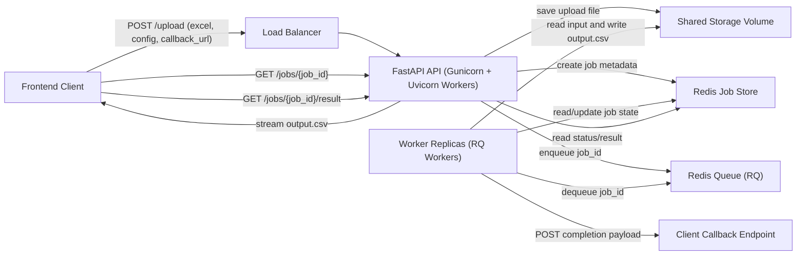
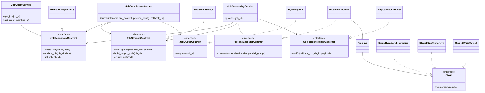
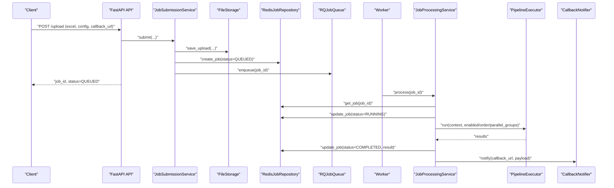
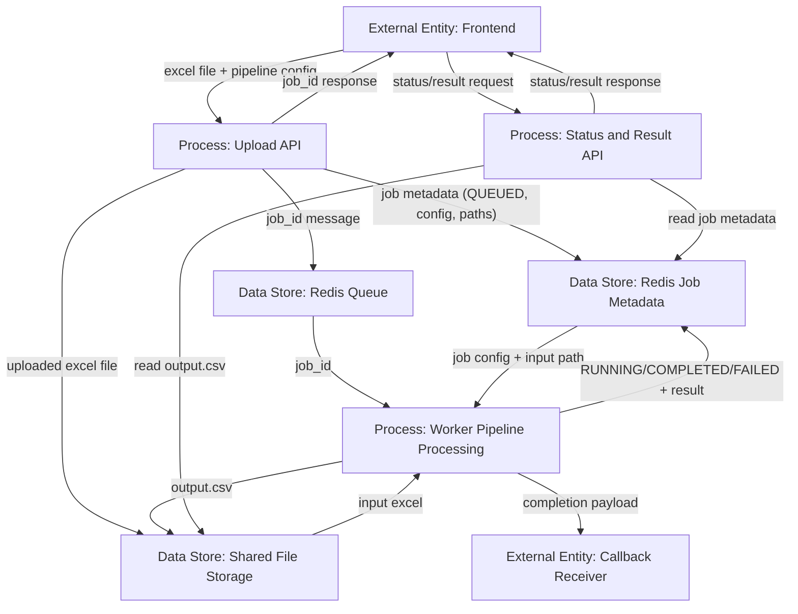

# Excel Pipeline Architecture

This document captures the High-Level Design (HLD), Low-Level Design (LLD), UML, and Data Flow Diagram for the project.

## HLD

### System Overview
- Frontend uploads Excel through `POST /upload`.
- FastAPI validates input, stores the file, writes initial job metadata, and enqueues job id in Redis-backed RQ.
- Worker replicas consume job ids, execute pipeline stages, and update job state/result.
- Client checks progress with `GET /jobs/{job_id}` and downloads output with `GET /jobs/{job_id}/result`.
- Optional callback URL is notified when processing finishes.

### Architecture Diagram

## LLD

### Module Responsibilities
| Layer | File | Responsibility |
|---|---|---|
| API | `app/main.py` | HTTP endpoints only. |
| Composition Root | `app/dependencies.py` | Wires concrete adapters into services. |
| Use Cases | `app/services.py` | Submission, querying, processing workflows. |
| Contracts | `core/contracts.py` | Abstractions for repo, storage, queue, executor, notifier. |
| Pipeline Engine | `core/pipeline.py` | Dependency validation and execution planning. |
| Stage Contract | `core/interfaces.py` | Stage abstraction for all stage implementations. |
| Stage Implementations | `core/stages.py` | Stage1 load/normalize, Stage2 CPU transform, Stage3 output write. |
| Executor | `core/executors.py` | Creates stage map and runs pipeline. |
| Infra Adapter | `infrastructure/repository.py` | Redis-backed job repository. |
| Infra Adapter | `infrastructure/queue.py` | RQ enqueue adapter. |
| Infra Adapter | `infrastructure/file_storage.py` | Shared file storage adapter. |
| Infra Adapter | `infrastructure/notifier.py` | HTTP callback notifier. |
| Worker Entrypoint | `app/tasks.py` | Worker task invoking processing service. |

### Processing Flow
1. `POST /upload` parses config and file.
2. `JobSubmissionService.submit` saves file, creates job metadata, enqueues job.
3. Worker executes `run_pipeline_job`.
4. `JobProcessingService.process` updates status to `RUNNING`, executes pipeline, stores result as `COMPLETED` or `FAILED`, then notifies callback if provided.
5. Client reads job status or downloads generated CSV.

## UML

### Class Diagram

### Sequence Diagram

## Data Flow Diagram

